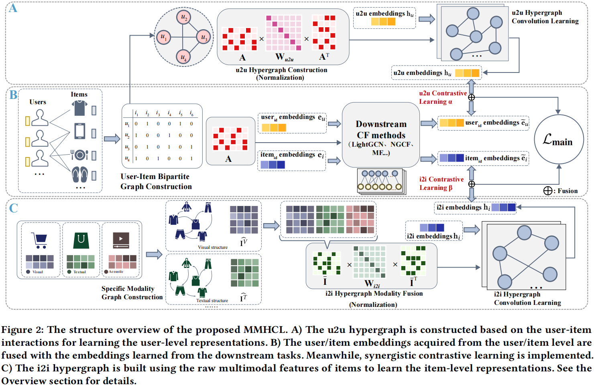
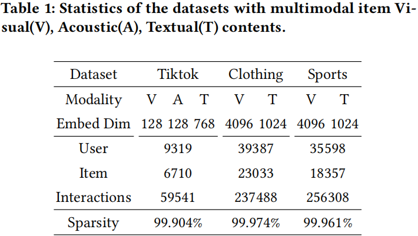

# MMHCL: Multi-Modal Hypergraph Contrastive Learning for Recommendation

This is the Pytorch implementation for our ACM TOMM'2025 paper:[MMHCL: Multi-Modal Hypergraph Contrastive Learning for Recommendation](https://arxiv.org/abs/2504.16576).

<p align="center">

</p>

🚀MMHCL is a new multimodal recommendation framework designed to alleviate data sparsity and cold-start issues. It constructs two hypergraphs, a user-to-user (u2u) hypergraph and an item-to-item (i2i) hypergraph, to mine shared preferences among users and intricate multimodal semantic resemblances among items, respectively. Meanwhile, we design a synergistic contrastive learning paradigm to effectively enhance feature distinguishability.

<h2>Dependencies </h2>
The code has been tested running under Python 3.10.13. All experiments are conducted on an NVIDIA 24GB 3090 GPU. The required packages are as follows:

* [Pytorch](https://pytorch.org/) == 2.0.1+cu118
* numpy == 1.24.3
* scipy == 1.10.1
* [scikit-learn](https://scikit-learn.org/stable/) == 1.2.2

<h2>Datasets</h2>

The origin recommendation datasets can be found via Tiktok platform and [Amazon product](http://jmcauley.ucsd.edu/data/amazon/links.html).

✨✨
We provide public three pre-processed datasets requiring no additional processing, including (1) basic user-item interactions and (2) multi-modal features, available on [Google Drive](https://drive.google.com/drive/folders/1yitfcangRzsWtYM1MokMyWPGPr8heBxB?usp=drive_link)/[Baidu Cloud](https://pan.baidu.com/s/1ZOE7BqSyrqD3rB2B2XLMcQ?pwd=pypk)/[Huggingface](https://huggingface.co/datasets/Xu-SII-BNU/MMHCL).
The TikTok dataset is provided by and identical to [MMSSL](https://github.com/HKUDS/MMSSL). The Clothing and Sports datasets are provided by and identical to [LATTICE](https://github.com/CRIPAC-DIG/LATTICE). Thanks for their work!

🔥🔥To advance multimodal recommender systems, we provide reference code for preprocessing the [original Amazon datasets](http://jmcauley.ucsd.edu/data/amazon/links.html) in `preprocess/data_preprocess.ipynb` to support other research needs (e.g., multimodal sequential recommendation). 
We spent some time on this preprocessing process.If this is helpful to your work, please kindly cite our work. 
<p align="center">

</p>
<h2>Usage </h2>

Download and place the datasets ([Google Drive](https://drive.google.com/drive/folders/1yitfcangRzsWtYM1MokMyWPGPr8heBxB?usp=drive_link)/[Baidu Cloud](https://pan.baidu.com/s/1ZOE7BqSyrqD3rB2B2XLMcQ?pwd=pypk)/[Huggingface](https://huggingface.co/datasets/Xu-SII-BNU/MMHCL)) in the project subdirectory:
  ```
  ├─ MMHCL/ 
      ├── data/
        ├── Tiktok/
        ...
      ├── codes/
      ...
  ```
Start training and inference as:

```
cd MMHCL
python ./main.py --dataset {DATASET}
```
Supported datasets:  `Tiktok`, `Amazon-Clothing`, `Amazon-Sports`
More parameter tuning can be changed in file `codes/utility/parser.py`. And the best training log in `/log`.

<h1> Citing </h1>

If you find this work helpful to your research, please kindly consider citing our paper.


```
@article{guo2025mmhcl,
  title={MMHCL: Multi-Modal Hypergraph Contrastive Learning for Recommendation},
  author={Guo, Xu and Zhang, Tong and Wang, Fuyun and Wang, Xudong and Zhang, Xiaoya and Liu, Xin and Cui, Zhen},
  journal={arXiv preprint arXiv:2504.16576},
  year={2025}
}
```


## Acknowledgement

The structure of this code is mainly based on [MMSSL](https://github.com/HKUDS/MMSSL) and [LATTICE](https://github.com/CRIPAC-DIG/LATTICE). Thanks for their excellent work!

